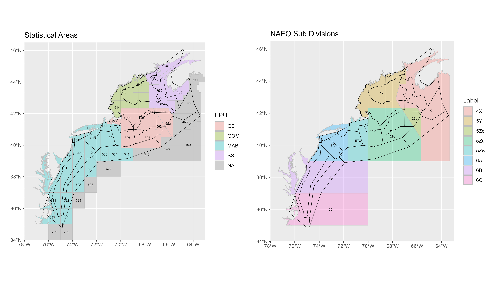

```{r setup, include=FALSE}
knitr::opts_chunk$set(echo = TRUE)
```

## Assembling the catch data from Atlantis

Neus Atlantis uses catch data over the period of 1985 - 2020 to force the model.

The catch data is a combination of

*   [`stocksmart`](https://noaa-edab.github.io/stocksmart/) data (Federally managed stocks)
*   Domestic commercial  landings using [`comlandr`](https://noaa-edab.github.io/comlandr/) data
*   [NAFO 21A](https://www.nafo.int/Data/STATLANT-21A) (Northwest Atlantis Fisheries Organization) for foreign landings 

For species that are Federally managed and assessed we use the catch data from the assessments (`stocksmart`). For other species we rely on the `comlandr` package for domestic landings and then add foreign landings from the NAFO 21A database.

### Domestic landings: comlandr

The [`comlandr`](https://noaa-edab.github.io/comlandr/) package was used to pull domestic landings meat weight (the shells of shellfish are not accounted for) by statistical area. Species were then assigned to atlantis [groups](https://github.com/NOAA-EDAB/neus-atlantis/wiki/Functional-Groups).

The function `data-raw/create_comlandr_US_catch_data` is used to achieve this.

Note: 
* Discards and recreational fishing are not accounted for in species data pulled from the commercial landings (`comlandr`)
* There are many species from the `comlandr` pull that are not assigned to an atlantis group. The reason being that they do not exist in the main [Atlantis groups](https://github.com/NOAA-EDAB/neus-atlantis/wiki/Functional-Groups)


### Foreign landings: NAFO

Since atlantis requires catch by gear on an annual basis, database [21A from NAFO](https://www.nafo.int/Data/STATLANT-21A) was used. Total catch in metric tons per year by species and country is recorded. Each species was again assigned to each atlantis group.

The spatial [footprint](#footprint) for the NAFO data is on a more coarse footprint than that of the domestic landings. No effort was made to proportion the data to the NEUS region.


The function `create_nafo21a_catch_data` is used to achieve this.

### Federally managed stocks: `stocksmart`

`data-raw/create_stockSMART_catch_data.r` is used to pull the stocksmart data and associate species with atlantis groups (using functionalGroupNames.csv which can be found on the [wiki](https://github.com/NOAA-EDAB/neus-atlantis/wiki/Functional-Groups)).

Note: the footprint is for each stock is different and may lie outside our defined NEUS footprint. However all species are defined as Northwest Atlanic stocks.

Some of the species in stocksmart don't cover the span from 1985-2020. Some are often missing a year or two from either the start or the end of the time series. To remedy this the time series is supplemented using one of two methods

* If the comlandr data has a similar trend over this period, then the mean difference (over the whole avaiable time series) between the stocksmart and comlandr data is used to scale the comlandr data.
* If the trends do not look similar the mean of the first/last n years of the stocksmart time series is used. (n = 3)

### Footprint 

The NEUS model footprint compared with the statistical areas and the NAFO divisions

```{r foot, echo = F}


```

## Pulling all sources together.

Each function used to process a data stream has the option to save the processed data as an rds file. These data files are then read in to `create_neus_catch_data.r` where the stocksmart data is analysed for "missing" data (at start or end of time series). The method for imputing missing data is defined in `functionalGroupNames_catchsource.csv`

The NAFO codes are mapped to NEUS groups as specified in `nafo_neus_codes.csv`

The NAFO shellfish codes are then scaled from live weight to meat weight by a single time invariant scalar. This scalar is calculated using the comlandr data and is defined by the mean proportion of meat weight/live weight

The missing data in comlandr (definedby NAs) are then linearly interpolated. Missing endpoints are replace by a 3 yr average as described is the stocksmart section  


Note: some species codes, in particular groups of species identified as "Not Specified", were not included in the foreign landings since they could not be confidently assigned to any one group.

```{r nafons, echo = F}
knitr::include_graphics("../data-raw/figures/nafo_ns_catch.png")
```

## Caveats

* No Discards or rec data for species using comlandr data

* Species codes in comlandr not present in Atlantis species list. So some species catch are not being accounted for in Atlantis model

* Some species in NAFO can not be accurately mapped to Atlantis groups

* Spatial footprints of NAFO, stat areas, Atlantis do not line up